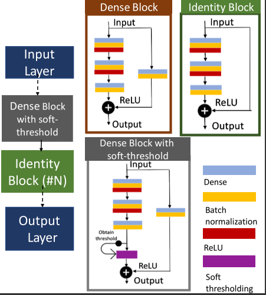

# Residual Regression Networks
Residual Regression Networks with denoising component for deep-learning based model fitting

Traditional quantitative MRI (qMRI) signal model fitting to diffusion-weighted MRI (DW-MRI) is slow and requires long computational time per patient. In this work, we
explore q-space learning for prostate cancer characterization. Our results show that deep residual regression networks are needed for more complex diffusion MRI models such as VERDICT with compensated relaxation.

### Referencing and citing

If you use this repository, please refer to this citation:
```
Valindria, V., Palombo, M., Chiou, E., Singh, S., Punwani, S., & Panagiotaki, E. (2021, April). Synthetic Q-Space Learning With Deep Regression Networks For Prostate Cancer Characterisation With Verdict. In 2021 IEEE 18th International Symposium on Biomedical Imaging (ISBI) (pp. 50-54). IEEE.
```

This repository provides the codes for Model 3: stacked residual regression network with soft thresholding, as it is show to work effectively to remove noise-related features in MRI signals. Soft threshold can be learned in the dense block unit,  before addition with residual connection, as shown in this Figure.




### How to Use

1. Setup a virtual environment with these dependencies:
```
   keras with tensorflow backend
   scipy
   pandas
```

2. Start playing
```
train_resreg.py
```

3. Data you may need:

a. For training
Synthetic training data (in-silico) q-space learning -  generated from equations derived from a diffusion model. For our model, it is from VERDICT (please refer to another repository on how to generate this).
If you don't have it, you can use the one under ```training_data\```
 
b. For model prediction:
Patient data for model prediction (pre-processed and registered). Predict the parameters from trained networks from DW-MRI scans (depends on protocols).
Please refer to another repository on how to obtain this format from raw DW-MRI data.
